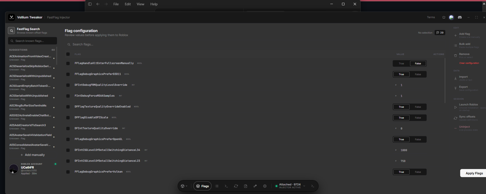
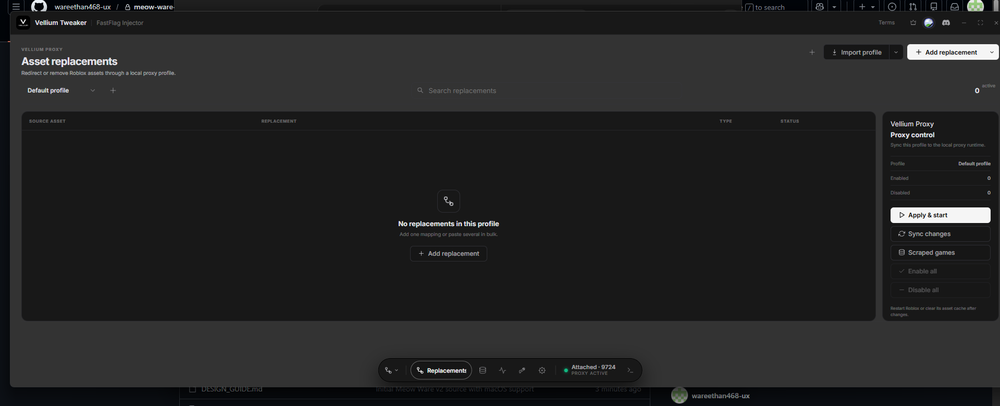
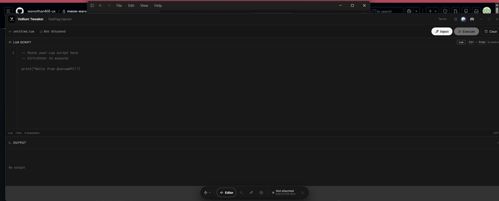

<div align="center">
  
  <h1>Meow Ware V2 · Vellium Tweaker</h1>
  <p>A desktop workspace for managing Roblox FastFlags, presets, sources, and supported companion tools.</p>

  
  
  
  
</div>

## The product

Vellium Tweaker brings the project's tools into one consistent desktop interface. The primary product is the FastFlag Injector: search known flags, create a configuration, organize presets, and write the result to Roblox's `ClientAppSettings.json`.

On Windows, the app also exposes Vellium Proxy for local asset-replacement profiles. The script editor is Windows-only. On macOS, the application stays in FastFlag mode and clearly marks Windows-only products as unavailable.



## Features

- Search and browse the bundled FastFlag catalog.
- Add boolean, integer, float, and string flags.
- Import, export, reorder, and reuse configurations as presets.
- Apply configurations through `ClientAppSettings.json`.
- Manage FastFlag definition sources and use the bundled offline fallback.
- Customize the interface with themes and local appearance settings.
- Build a native Windows executable or macOS application bundle.
- Use local asset-replacement profiles through Vellium Proxy on Windows.

## Product views

### FastFlag Injector

The main workspace combines catalog search, editable values, imports and exports, preset management, source syncing, and Roblox launch controls. Windows supports the full integration. macOS uses the file-based `ClientAppSettings.json` path without Windows process-memory features.

### Vellium Proxy · Windows only

Create profiles that map Roblox asset identifiers to local replacements, inspect saved mappings, and synchronize an active profile with the local proxy runtime.



### Script editor · Windows only

The Windows build includes a focused Lua editor surface with connection state, line numbers, keyboard shortcuts, and an output panel.



## Platform support

| Capability | Windows 10/11 | macOS |
|---|:---:|:---:|
| FastFlag catalog and editor | ✅ | ✅ |
| Presets, imports, and exports | ✅ | ✅ |
| `ClientAppSettings.json` application | ✅ | ✅ |
| Themes and local settings | ✅ | ✅ |
| Live Windows offset features | ✅ | — |
| Vellium Proxy | ✅ | — |
| Script editor integration | ✅ | — |

The macOS build searches for Roblox at `/Applications/Roblox.app` and `~/Applications/Roblox.app`. Application settings are stored under `~/Library/Application Support/MeowWare`.

## Run from source

Prerequisites:

- Python 3.13
- Node.js 22 or newer
- npm

```bash
git clone https://github.com/wareethan468-ux/meow-ware-v2.git
cd meow-ware-v2
npm ci
npm run build
python -m pip install -r requirements.txt
python main.pyw
```

## Build for Windows

Run this on a 64-bit Windows 10 or Windows 11 computer:

```powershell
python build_exe.py
```

The standalone executable is written to `dist/VelliumTweaker.exe`. The build script automatically selects Python 3.13 when a newer Python version is currently active.

## Build for macOS

PyInstaller cannot cross-compile a macOS application from Windows. Run the build on a Mac:

```bash
python3 build_macos.py
```

The resulting application is written to `dist-macos/Vellium Tweaker.app`.

GitHub's macOS artifact is ad-hoc signed but cannot be Apple-notarized without a Developer ID certificate. After extracting the ZIP, double-click `Open Vellium Tweaker.command` the first time. The helper removes the quarantine marker from this app only and launches it; later launches can use the `.app` normally.

## Automatic GitHub builds

The `Build Vellium Tweaker` GitHub Actions workflow runs automatically for every push and pull request targeting `main`. It builds both platforms in parallel and uploads `Vellium-Tweaker-Windows` and `Vellium-Tweaker-macOS` under the workflow run's **Artifacts** section. It can also be started manually from the repository's **Actions** tab.

## Configuration

The desktop app stores user settings outside the repository:

- Windows: `%LOCALAPPDATA%\MeowWare`
- macOS: `~/Library/Application Support/MeowWare`

The Discord bot requires `DISCORD_TOKEN` and `SUPABASE_SECRET_KEY` environment variables. The desktop license client uses a Supabase publishable key; never place a Supabase secret/service-role key or Discord token in source control.

## Repository layout

```text
web/                 React desktop interface
src/core/            FastFlag, Roblox, preset, and source logic
src/gui/             pywebview desktop bridge
src/data/            bundled fallback flag definitions
website/             product website
bot/                 optional Discord bot
build_exe.py          Windows standalone build
build_macos.py        macOS application build
```

## Safety and account responsibility

FastFlags are internal Roblox configuration switches and can change or stop working without notice. Back up configurations, avoid unknown flags, and follow Roblox's terms and applicable platform rules. This project is not affiliated with or endorsed by Roblox Corporation.

## License

Licensed under the [PolyForm Noncommercial License 1.0.0](LICENSE). Commercial use is not permitted by that license.
